# ChessMaster
build with React JS, Socket IO and WebRTC

## In Chess Game Examples

### Basic Moves

#### Pawn First Move
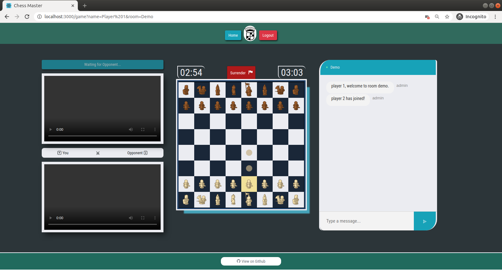
 

#### Pawn Normal Move
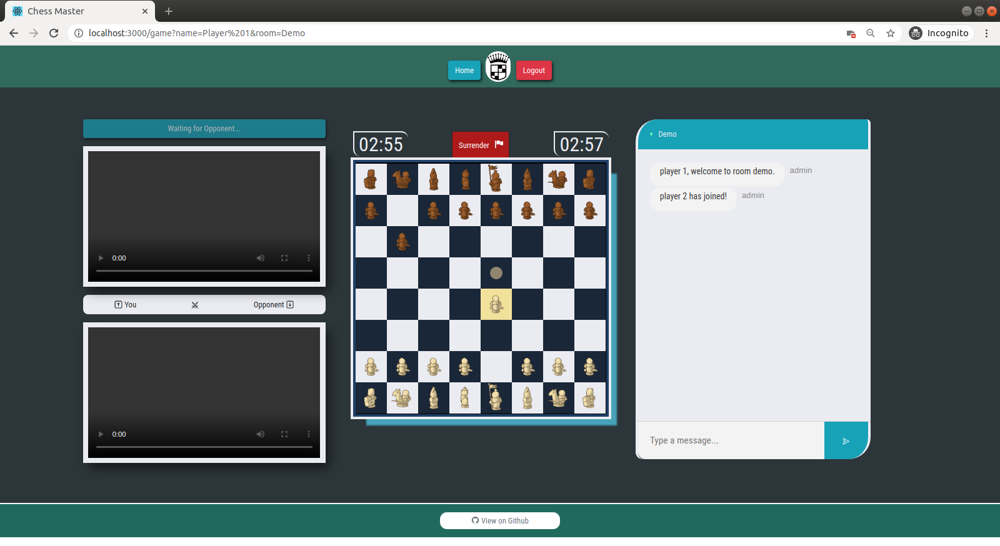
 

#### Pawn Special Move
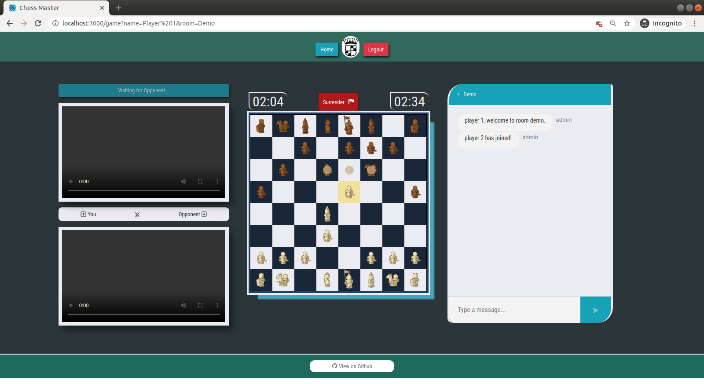
 

#### Rook Legal Moves
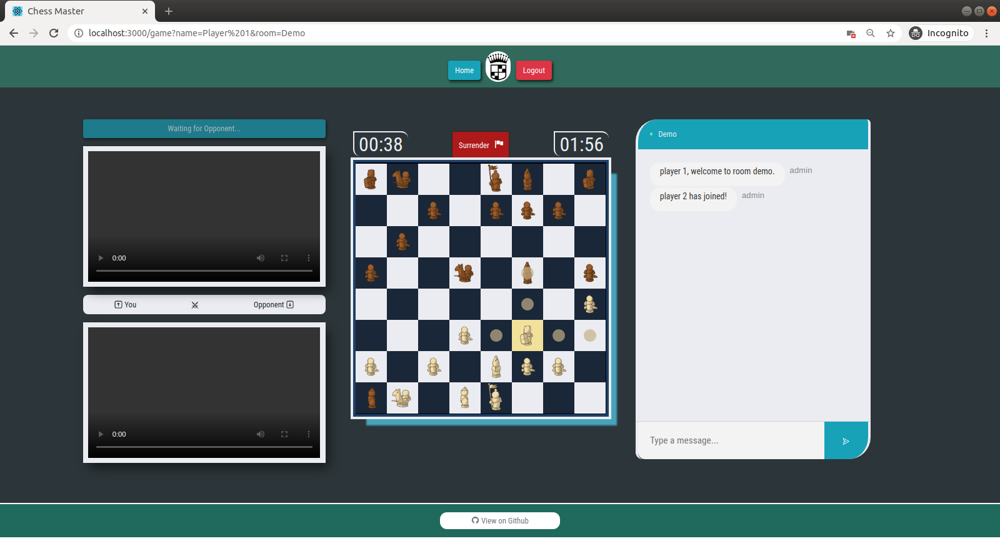
 

#### Knight Legal Moves
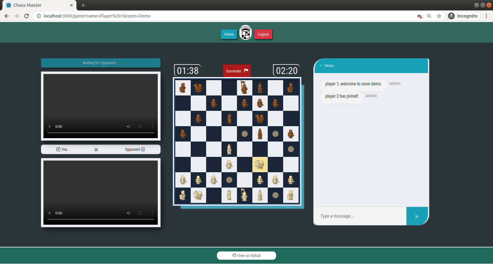
 

#### Bishop Legal Moves

 

#### Queen Legal Moves
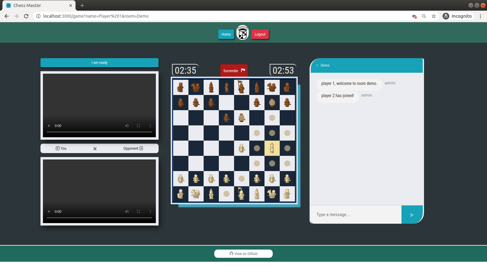
 

#### King Legal Moves
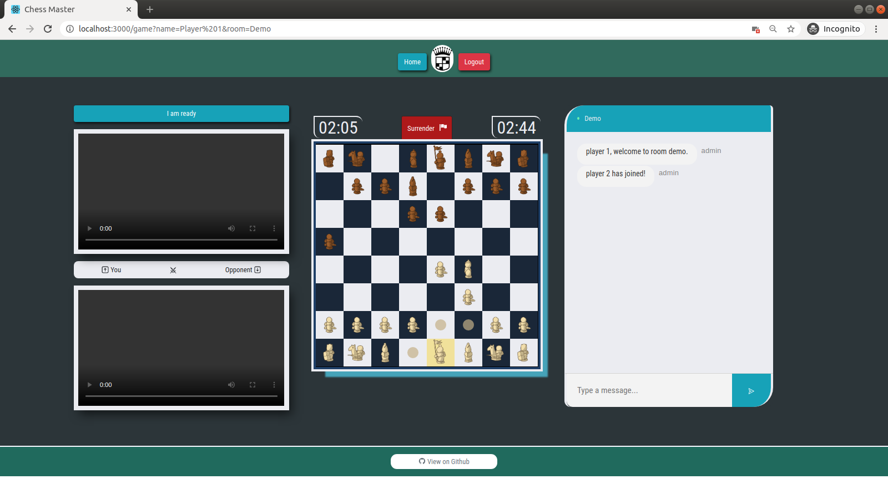
 

### Some Conditions

#### Pawn Promotion
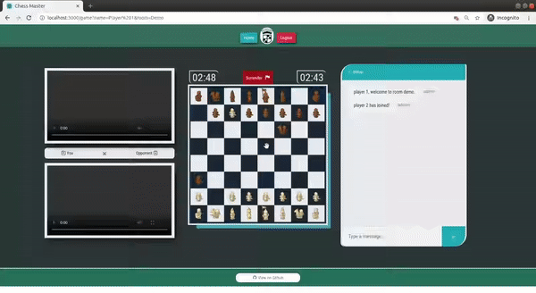
 

#### Save King First

 

#### Cannot Make Any Move That Puts Their Own King in Check
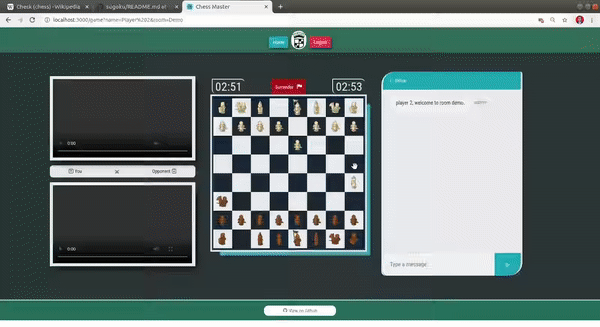
 

#### Check
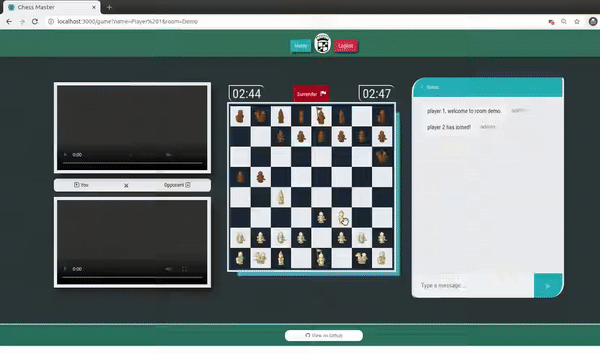
 

#### Castling

 

#### King Cannot Do Castling After Getting Check
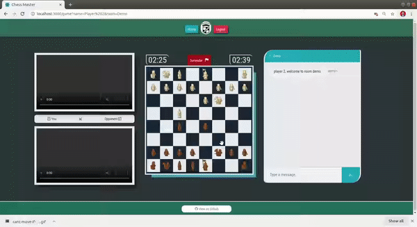
 

#### Checkmate
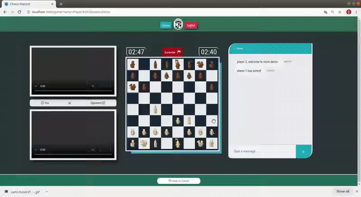
 